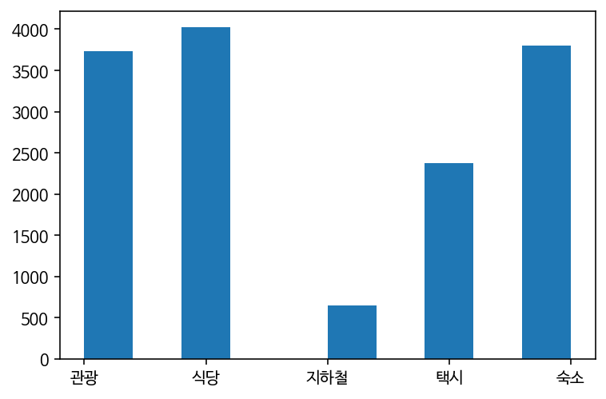
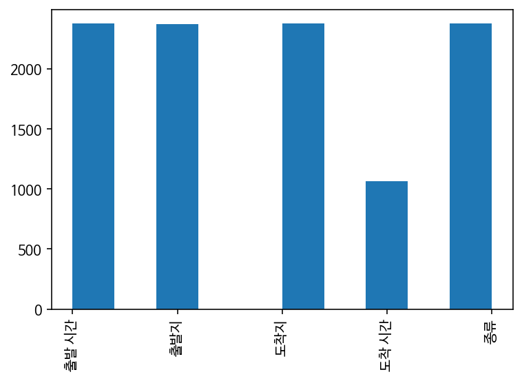
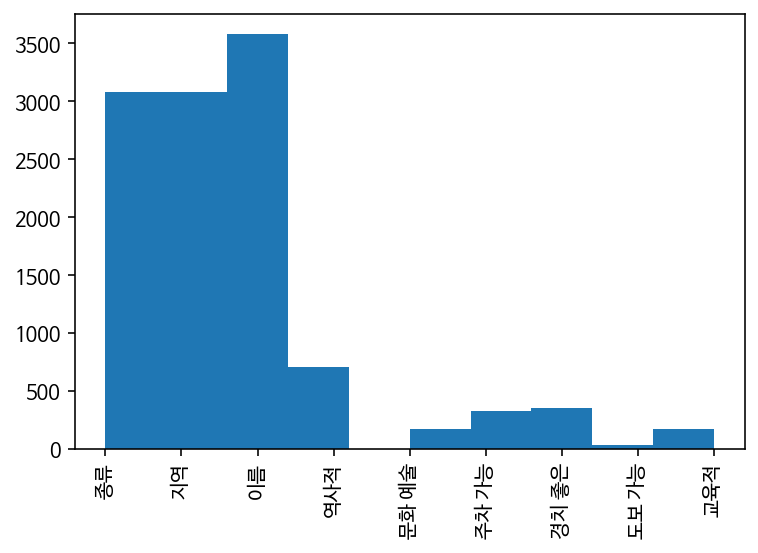
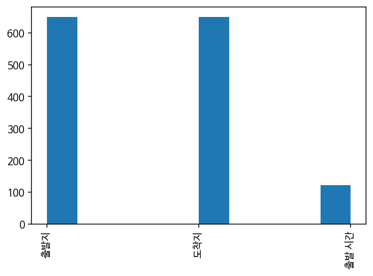
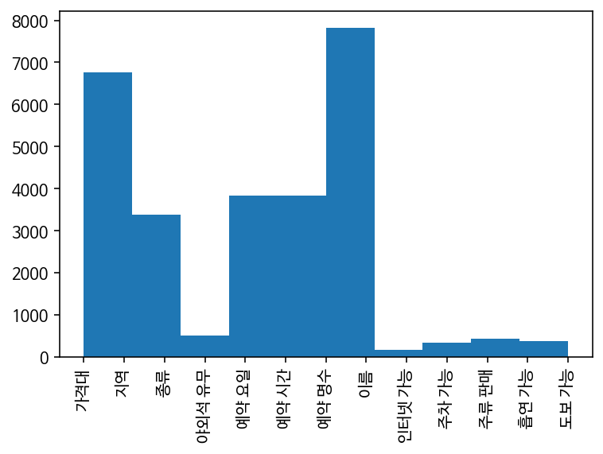
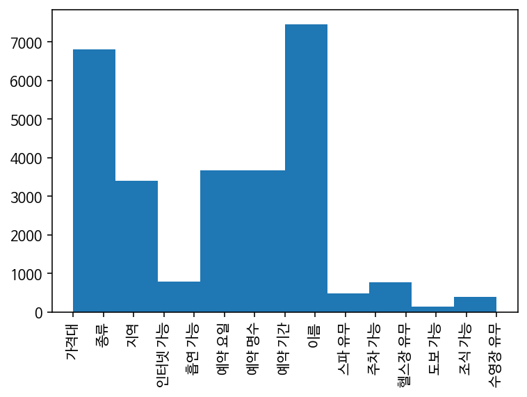
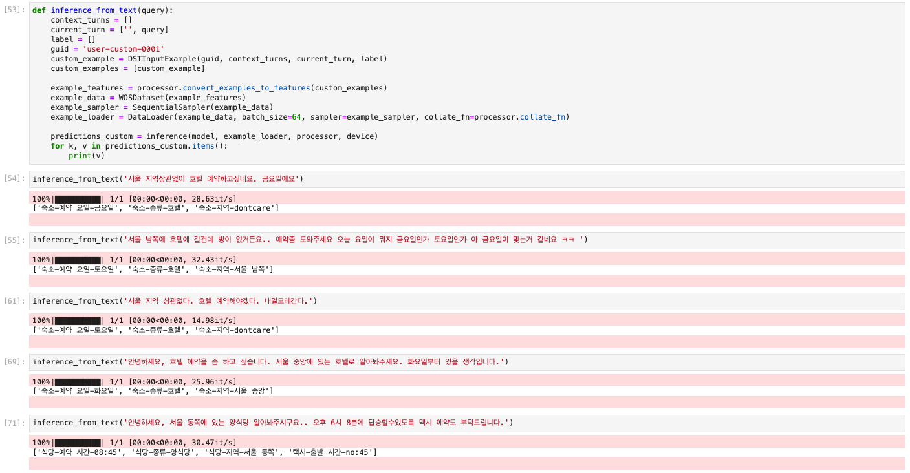
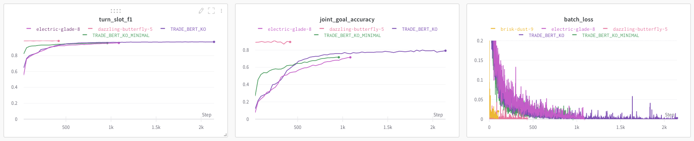

# [Stage 3] Dialogue State Tracking (Wizard of Seoul Dataset)

**홍승우 T1226**

[https://github.com/bcaitech1/p3-dst-coffee-factory](https://github.com/bcaitech1/p3-dst-coffee-factory)

☕️  **커피공장 (Coffee Factory)** [DST 1조] - 민지원, 이애나, 정지훈, 진소정, 최병민, 홍승우

*May, 2021 - Boostcamp AI Tech*

리더보드 Public (0.7977) / **Private (0.6926)** 팀 최종 3위

---

## 📂 문제 정의와 데이터셋

**대화 상태 추적 (Dialogue State Tracking)**은 유저와의 대화에서 유저가 원하는 대화 상태 정보를 매 턴마다 추론하는 task 로써, 이번 P-Stage 세번째 대회에선 미리 정의된 시나리오 안에서 특정 목적을 수행하기 위해 대화를 진행하는 목적 지향형 대화 (Task-Oriented Dialogue)를 가정했다. 사용자의 입력 대화 턴 마다 미리 정해진 (파악해야 하는 정보) slot 들에 해당하는 value 를 예측해야 했다. 대회 기간은 4주 였으며, 6명으로 구성된 '커피공장' 팀으로써 각자 서버 환경에서 V100 GPU 1장을 사용하여 학습하였다.

- **평가 지표**
    - Joint Goal Accuracy (JGA) - 추론과 실제가 완벽히 일치하는지 여부 측정
    - Slot Accuracy - Slot, value 페어에 대한 Accuracy 를 추정
    - Slot F1 Score
    - 리더보드는 Joint Goal Accuracy → Slot F1 Score → Slot Accuracy로 소팅

학습을 위해 한국어 dialogue 데이터셋인 Wizard-of-Seoul 을 사용했다. 7천개의 dialogue 학습 데이터와 2천개의 테스트 데이터로 구성되어 있었으며 총 다섯개의 도메인에 대해 45개의 슬롯이 미리 정해져 있었다.

---

## 📊 데이터셋의 구성에 따른 학습 전략

### Domain & slot 분포 알아보기



도메인 분포



도메인: 지하철 Slot 분포



도메인: 관광 Slot 분포



도메인: 지하철 Slot 분포



도메인: 식당 Slot 분포



도메인: 숙소 Slot 분포

학습 데이터셋에서 레이블 되어있는 domain 과 slot 의 종류와 그 분포를 확인해보았다. Slot 마다 분류와 생성 중 어떤쪽으로 접근해야 좋을지를 알 수 있었다. 이름과 시간 등의 slot 에선 pre-defined ontology 에 의존하는 분류 모델이 많이 취약할 것으로 보인다. 반대로, 유무나 지역 등의 slot 에선 분류 모델이 정확할 것으로 보인다. 기본적으로 none 이나 관계없음 등이 라벨의 대부분을 차지할 것으로 보여져, 모델에서 분류기는 필수적으로 필요해 보인다.

### N-grams

도메인 별로 연속된 N 개의 단어 서브셋을 살펴보았다. 인위적으로 만들어진 데이터셋이기 때문일 가능성이 크지만, 같은 단어 쌍들이 중복되어 많이 나타남을 알 수 있었다.

모델은 학습 과정에서 아래와 같이 나온 조합 (순서) 에 대해 집중할것으로 예상되며 실제 예측시 사용되는 단어가 다를 경우 (e.g. 서울 중앙에 vs. 서울 가운데 / 서울 남쪽에 vs. 서울 강남 등) 정확한 추적이 어려울 수 있을것으로 생각되었다.

아래 많이 나온 조합들에서 단어들을 동의어로 치환해주는 text augmentation 을 적용할 수 있을것 같다.

```
==============BIGRAM=============== 

============ 관광 TOP10 ============
[(('어떻게', '되나요?'), 489),
 (('서울', '북쪽에'), 414),
 (('서울', '중앙에'), 412),
 (('안녕하세요.', '서울'), 290),
 (('경치가', '좋은'), 270),
 (('그리고', '서울'), 260),
 (('좀', '알려주세요.'), 239),
 (('수', '있나요?'), 216),
 (('같은', '지역에'), 206),
 (('관광지를', '찾고'), 193)]

============ 식당 TOP10 ============
[(('적당한', '가격대의'), 454),
 (('서울', '중앙에'), 413),
 (('안녕하세요.', '서울'), 350),
 (('서울', '남쪽에'), 295),
 (('서울', '북쪽에'), 289),
 (('서울', '서쪽에'), 265),
 (('서울', '동쪽에'), 251),
 (('예약', '좀'), 238),
 (('같은', '지역에'), 236),
 (('예약해', '주세요.'), 229)]

============ 지하철 TOP10 ============
[(('가는', '지하철을'), 97),
 (('가는', '지하철'), 62),
 (('어떻게', '되나요?'), 52),
 (('근처', '역에서'), 48),
 (('식당', '근처'), 43),
 (('노선이', '어떻게'), 38),
 (('역으로', '가는'), 37),
 (('가는', '지하철도'), 36),
 (('관광지', '근처'), 35),
 (('지하철', '타고'), 30)]

============ 택시 TOP10 ============
[(('택시', '종류는'), 279),
 (('가는', '택시를'), 258),
 (('가는', '택시도'), 228),
 (('출발', '시간은'), 225),
 (('종류는', '아무거나'), 194),
 (('택시', '좀'), 174),
 (('저', '그리고'), 155),
 (('좀', '알려주세요.'), 136),
 (('수', '있는'), 133),
 (('아무거나', '괜찮아요.'), 119)]

============ 숙소 TOP10 ============
[(('적당한', '가격대의'), 432),
 (('안녕하세요.', '서울'), 364),
 (('서울', '남쪽에'), 326),
 (('서울', '동쪽에'), 316),
 (('서울', '중앙에'), 314),
 (('서울', '서쪽에'), 304),
 (('서울', '북쪽에'), 284),
 (('숙소를', '찾고'), 266),
 (('예약', '좀'), 213),
 (('예약해', '주세요.'), 212)]
```

```
==============TRIGRAM============== 

============ 관광 TOP10 ============
[(('서울', '중앙에', '있는'), 167),
 (('서울', '북쪽에', '있는'), 135),
 (('알', '수', '있을까요?'), 122),
 (('같은', '지역에', '있는'), 84),
 (('영업', '시간이', '어떻게'), 80),
 (('그리고', '서울', '중앙에'), 76),
 (('서울', '남쪽에', '있는'), 74),
 (('영업', '시간', '좀'), 71),
 (('저', '그리고', '서울'), 67),
 (('안녕하세요.', '서울', '북쪽에'), 66)]

============ 식당 TOP10 ============
[(('서울', '중앙에', '있는'), 162),
 (('같은', '지역에', '있는'), 132),
 (('서울', '남쪽에', '있는'), 98),
 (('서울', '북쪽에', '있는'), 95),
 (('안녕하세요.', '서울', '중앙에'), 92),
 (('있는', '적당한', '가격대의'), 91),
 (('서울', '동쪽에', '있는'), 89),
 (('예약', '좀', '해주세요.'), 79),
 (('예약', '해', '주세요.'), 74),
 (('서울', '서쪽에', '있는'), 72)]

============ 지하철 TOP10 ============
[(('근처', '역으로', '가는'), 27),
 (('노선이', '어떻게', '되나요?'), 21),
 (('식당', '근처', '역에서'), 19),
 (('지하철', '노선이', '어떻게'), 18),
 (('감사합니다.', '저', '그리고'), 17),
 (('관광지', '근처', '역에서'), 15),
 (('라인이', '어떻게', '되나요?'), 14),
 (('역으로', '가는', '지하철의'), 14),
 (('근처', '역에서', '숙소'), 12),
 (('도착지', '라인이', '어떻게'), 12)]

============ 택시 TOP10 ============
[(('택시', '종류는', '아무거나'), 92),
 (('감사합니다.', '저', '그리고'), 71),
 (('갈', '수', '있는'), 70),
 (('저', '그리고', '택시를'), 69),
 (('종류는', '아무거나', '괜찮아요.'), 59),
 (('다른', '건', '다'), 54),
 (('예약', '해', '주세요.'), 51),
 (('가는', '택시', '좀'), 48),
 (('택시도', '예약해', '주세요.'), 47),
 (('택시를', '예약하고', '싶은데요.'), 46)]

============ 숙소 TOP10 ============
[(('서울', '중앙에', '있는'), 103),
 (('서울', '남쪽에', '있는'), 94),
 (('예약', '해', '주세요.'), 89),
 (('서울', '동쪽에', '있는'), 85),
 (('서울', '북쪽에', '있는'), 79),
 (('서울', '서쪽에', '있는'), 78),
 (('같은', '지역에', '있는'), 76),
 (('숙소를', '찾고', '있어요.'), 75),
 (('안녕하세요.', '서울', '남쪽에'), 73),
 (('있는', '적당한', '가격대의'), 73)]
```

---

## 👨‍👧‍👧 팀 차원에서의 전략

팀원 모두 DST 를 처음 접한 상태였기 때문에, 기본 컨셉의 이해와 모델 원리에 대한 심층적인 이해가 필요했다. 팀 결성 당시 리더보드 순위에 목매기 보단 좋은 시도들을 서로 공유하며 발전 하자는 뜻에 모두 공감하였다.

우선 SUMBT, TRADE, SOM-DST 세가지 모델에 대해서 역할을 나눠 이해하고 코드를 뜯어보며 파이프라인을 수정해나가기로 하였다. 각자 맡은 모델을 WoS 데e이터셋에 맞게 학습 시키고, 결과를 공유했다.

모델 학습에 굉장히 오랜 시간이 걸렸기 때문에 모델을 나눠 학습하는 등 팀 차원에서의 접근이 매우 중요했던것 같다. 결과적으로 서로 다른 모델을 적용한 앙상블을 했을 때 크게 리더보드 점수가 오를 수 있었다.

최종적으로는 앙상블한 결과를 후처리 하는것을 함께 고민하였다.

팀 커뮤니케이션 플랫폼으론 Slack 를 사용하였고 피어세션에서 함께 고민한 내용 등은 팀 notion 페이지를 활용했다. 소스코드 관리는 github 팀 레포지토리를 사용했다.

---

## 🧮 Architectures

강의에서 많은 모델들을 다뤘지만, 한주에 하나의 모델을 이해하여 적용해보기로 계획하였다. 

다른 팀원분들은 SOM-DST 를 시도하기도 했지만, 학습이 잘 진행되지 않아 최종 제출 시 채택할 순 없었다.

### SUMBT

Ontology-based 모델인 SUMBT 는 slot 마다 정해진 ontology 중 하나를 분류해낸다. 1에폭당 학습 소요 시간과 수렴 까지의 시간이 TRADE 에 비해 비교적 빨랐으며, ontology 내에서 정답을 찾을 수 있는 slot 에선 안정적인 성능을 내주었다.

Test 데이터셋에는 ontology 에 없는 밸류들도 많이 존재하여 validation 할 때의 점수와 차이가 많이 났다. 랜덤 피어세션에서, SUMBT 성능 향상에 집중한 팀이 있었는데 채점 기준이 또 달랐던 private 에서 shake up 되어 순위가 많이 내려갔다는 후기를 듣게 되었다.

### TRADE

[[Stage 3] TRADE Baseline Review](https://www.notion.so/Stage-3-TRADE-Baseline-Review-212dab0ba0e649feac3edcae9bb0ecc1)

← 상세 코드 분석

TRADE 모델은 아무리 강의를 들어도 이해가 잘 가지 않아 베이스 라인 코드를 한줄 씩 뜯어보며 겨우 이해할 수 있었다.

생성 모델인 만큼, vocab size 가 더 큰 모델을 사용하면 좋을 것 같아 기존 35000개의 vocab size 를 갖는 모델을 42000개의 vocab size 를 갖는 모델로 교체하였다.

Ontology 에 없는 value 들도 직접 찾아 맞출 수 있어, validation 결과가 SUMBT 보단 오히려 좋지 못했지만, validation 점수와 리더보드 점수의 차이는 5-6% 정도로 SUMBT 보다 차이가 적었다. 단점으론, 수렴이 매우 느리고 학습시간이 오래걸렸다.

- **학습 시킨 TRADE 모델을 불러와 임의의 텍스트로 slot 들을 추적해본 모습**

    

### DST-STAR

같은 팀의 지원님께서 마지막까지 DST-STAR 모델을 학습시켜 주셔서 함께 앙상블에 포함할 수 있게 되었고 public 점수 0.7839 에서 0.7977 까지 성능을 올릴 수 있었다.

---

## 🚴‍♂️ Training



이번에도 편리한 WANDB 를 이용하여 학습 과정과 결과를 트래킹 하였다.

- 가장 먼저 TRADE 모델에서 인코더를 BERT KO MINIMAL 를 불러와 30 에폭 학습 - 0.7062 (validation 결과 수렴하지 않음)
- TRADE 모델에서 인코더를 BERT KOR BASE 사용하여 56 에폭까지 학습, 60 에폭에서 수렴 - 0.7383
- 최고 기록 (56 에폭) 체크포인트를 불러와 validation 비율 0.02 까지 줄여 추가 학습해봤으나 리더보드 상에서 점수 하락함 - 0.7270
- 수렴이 너무 느리고 학습 속도가 느려, 지난 대회에서 최고 성능은 아니었지만 빠른 수렴을 내준 MADGRAD 옵티마이저 사용해봄 - 수렴 step 에 차이가 없는것 같아 약 30 에폭에서 학습 중단
- Validation 없이 pseudo-labeling 한 데이터셋으로 추가 학습하였을 때 리더보드 기준으로 4에폭에서 수렴 - 0.7679

---

## 🧩 여러가지 시도들

### Pseudo-labeling

Pseudo-labeling 은 레이블이 데이터셋으로 먼저 학습 후, 정답 레이블이 없는 데이터셋을 예측하여 얻은 라벨로 2차 학습을 하는 것을 말한다. 이전에 해당 기법들을 다른 프로젝트들에서 적용했을 때 별 다른 효과를 보지 못해서 혹시나 하고 해봤는데, 이번 대회에선 놀랍게도 큰 성능 향상을 내주었다. 

앙상블하여 얻었던 최고 기록 (0.78)의 예측값들을 정답지로 사용하여 test 데이터를 pseudo-labeling 하여 2천개의 데이터를 더 확보할 수 있었다. TRADE 로 학습된 최고 성능에서의 checkpoint 를 불러와 추가로 4에폭 정도 더 학습하였다. 학습 데이터를 포함하지 않은 이유는 test 데이터에 의도적으로 오버피팅 시키므로서 test 데이터에서 잘 맞추는 모델이 될 수 있을것이라 생각하였기 때문이다. 또한 JGA 가 80% 였던 상황에서 pseudo-labeling 을 한다면 80% 는 정답, 20%는 잘못된 라벨링이라고 할 수 있는데 오히려 노이즈를 추가한 학습에서 모델이 robust 하게 될 수 있었던것 같기도 하다.

결과적으로, 단일 모델 중 최고 기록이었던 0.7383 에서 추가로 학습 시켰을 때 0.7679 까지 올릴 수 있었다.

### Post-processing

- Rule-based 로 시간 등 생성 모델에서 생성된 value를 일정한 포맷으로 맞춰주는 후처리 테크닉이 사용되었다.
- 예측된 value 값을 임베딩 한 후 ontology 에 존재하는 value 와 cosine-similarity 를 계산하여 하드 코딩된 임계치를 넘게되면 ontology 에 존재하는 값으로 대체하였다. 이로써 사소한 철자오류 교정효과 얻을 수 있었다.

### Ensemble

최종적으로 6개의 모델을 모두 합쳐 앙상블을 하였다. 모델의 성능을 반영하기 위해 퍼블릭 리더보드의 스코어를 가중치로 두어 하드보팅 하는 방법을 채택했다.

최초 pseudo-labeling 하지 않았던 TRADE (0.73) 결과와 다른 backbone 인코더를 사용한 TRADE, SUMBT 결과들을 취합해 앙상블 하였을때 무려 5% 오른 0.78을 달성할 수 있었다.

- TRADE (kykim bert base kor) - 0.7383
- TRADE (pseudo-labeled 추가학습) - 0.7679
- SUMBT - 0.6344
- DST-STAR (지원님 학습) - 0.6352
- TRADE with TAPT (kykim bert base kor - 지훈님 학습) - 0.7382
- SUMBT (지훈님 학습) - 0.6295

---

## 🧾 Retrospect

### 발전한 부분

처음 2주 동안은 DST 태스크가 너무 어려워 강의를 계속 돌려보며 팀원들과 서로 이해한 부분들을 공유하였다. 그로 인해 처음 팀 결성 당시 다양한 가설을 세우고 실험을 해보자는 계획은 잘 지키지 못하였지만, 포기하지 않고 완주하여 대회가 종료된 지금 시점에서 어느정도 깊이있게 맡은 모델들에 대한 이해를 가져갈 수 있게 되었다. 그 과정에서 SUMBT와 TRADE 코드를 뜯어보며, 이론 공부할 때 잘 와 닿지 않던 attention 과 생성 매커니즘을 적용하는 방법을 이해할 수 있었다.

팀으로의 대회 참여를 처음 해봤는데, 논문 리뷰하는것과 같이 서로 모델을 하나씩 잡고 각자 이해한 부분과 코드단에서 이해하지 못한 부분을 서로 공유하고 고쳐가며 발전할 수 있었다. 또한, DST 와 같이 학습이 오래 걸리는 작업의 경우, 여럿이 역할을 나누어 학습시켜 다양한 모델들을 앙상블 하는 것은 팀으로 참여할 때의 최대 장점이었던 것 같다.

### 아쉬운 점 & 다음 번에 발전시킬 점

모델 학습에 너무 오랜 시간이 걸려 내부의 GRU 를 LSTM 이나 다른 디코더로 교체하는 등의 실험을 해보고 싶었다. 하지만 시간이 부족한 상황에서, 잘못된 접근을 하여 학습 시간을 허비한다면 팀 결과에 안좋은 영향을 미칠 수 있어 최대한 안정적인 보장된 방향 안에서 튜닝을 해나간 것 같다. 이 부분에 대해서, 마지막 멘토링 시간에 (학습 데이터셋 전체를 대표할 수 있는) 더 작은 학습 데이터셋을 샘플링 하여 실험을 해보면 좋다는 조언을 얻어 다음 번에 시도해보면 좋을것 같다고 생각했다.

DST 는 어려운 프로젝트였지만, 챗봇 등의 시스템에서 사용자가 원하는 조건 등을 필터링하기 위한 기반이 되는 기술이기 때문에 끝까지 대회를 완주한 부분에 대해 긍정적으로 생각하고 싶다. 다만, pseudo-labeling, 앙상블 같은 대회용 솔루션 보다는 모델 내부 구조를 직접 변경하며 더욱 효과적인 모델을 제안할 수 있는 수준이 될 수 있도록 앞으로 더욱 노력해야겠다고 생각했다.
